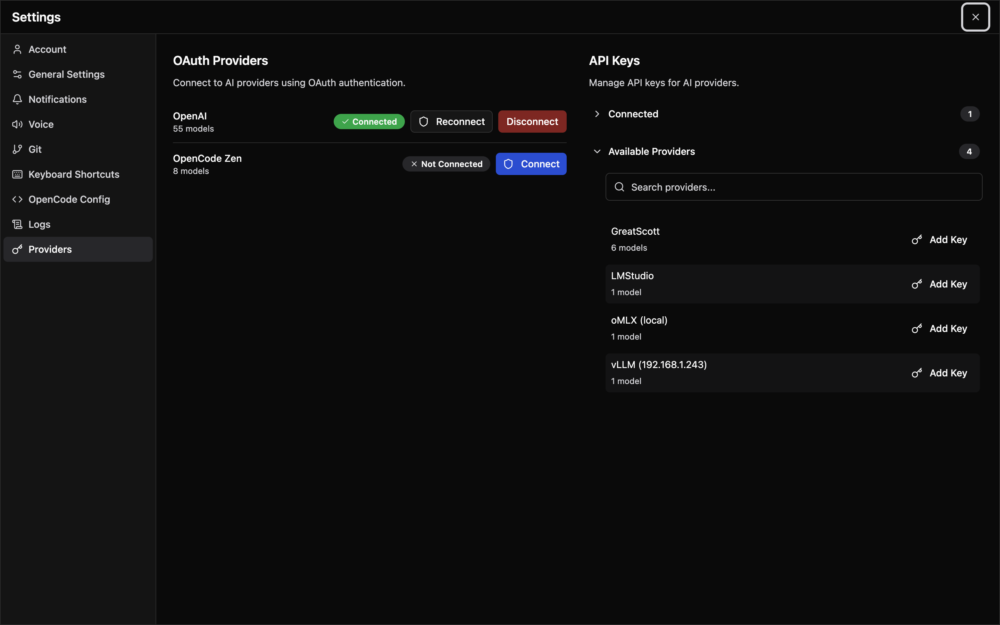

# AI Configuration

Configure AI models, providers, and custom agents.

## Model Selection

### Quick Model Switcher

A compact model switcher is embedded directly in the chat interface. Click the **model name** in the prompt area or chat header to open the quick-select popover:

| Item | Description |
|------|-------------|
| **Active model** | Shown at the top with a checkmark. Click the star icon to add or remove from favorites. |
| **Favorites** | Pinned models always appear first in the list. |
| **Recents** | Last 10 used models appear below favorites (excluding the active one and any favorites). |
| **Variants** | Some models offer tier options (e.g., fast or pro). Variant items are highlighted and show a checkmark on the active selection. |
| **More models** | Opens the full model browser when you need a model not in recents or favorites. |

Favorites, recents, and variant choices are stored in OpenCode's own state file (`.opencode/state/opencode/model.json` in the workspace), so they are shared with the OpenCode TUI and survive Manager restarts. The active model itself is not persisted: on page load it resolves the same way the OpenCode TUI does — the `model` set in `opencode.json`, otherwise your most recent valid model, otherwise the provider default. A model you pick during a session stays active until the page is reloaded.

### Per-Agent and Per-Session Models

Each agent can declare its own `model` in `opencode.json`, which becomes that agent's default. When you open an existing session, the model, agent, and variant used by its last message are restored from the session itself, so switching between sessions keeps each one's selection.

### Full Model Browser

To browse all available models:

1. Click **More models** in the quick-select popover
2. Filter by provider or search by name
3. Click a model to select it

### Changing Models Mid-Session

You can switch models at any point during a session without losing context. The new model is used for all subsequent messages.

## Providers

Configure API keys or OAuth for AI providers.



### API Key Method

1. Go to **Settings > Providers**
2. Select a provider (OpenAI, Anthropic, etc.)
3. Enter your API key
4. Click **Save**

### OAuth Method

For providers that support OAuth (Anthropic, GitHub Copilot):

1. Go to **Settings > Providers**
2. Under **OAuth Providers**, click **Connect** (or **Reconnect**) on the provider
3. In the **Connect to <provider>** dialog, choose an authentication method
4. Complete the flow:
   - Browser-based methods open the provider's sign-in page
   - Code-based methods show an **Authorization Code** field; paste the code and click **Complete Authentication**

### Testing Credentials

After adding credentials:

1. Open a chat session and click the model selector
2. Models from that provider should appear
3. Select a model and try sending a message

If models don't appear, verify your API key and check for errors.

## Custom Agents

Create specialized AI agents with custom configurations.

### Creating an Agent

1. Go to **Settings → OpenCode Config → Agents**
2. Click **Add Agent**
3. Configure:
   - **Name** - Display name for the agent
   - **Description** - What this agent does
   - **System Prompt** - Instructions for the AI
   - **Default Model** - Model to use
   - **Tools Configuration** - Toggle the built-in Write, Edit, Bash, and Web Fetch tools

4. Click **Save**

### System Prompt Tips

Write effective system prompts:

```
You are a code review expert specializing in TypeScript and React.

When reviewing code:
1. Check for type safety issues
2. Look for potential bugs
3. Suggest performance improvements
4. Ensure consistent code style

Be concise but thorough. Prioritize issues by severity.
```

### Tool Permissions

The **Tools Configuration** section toggles each built-in tool on or off:

- **Write** - Create and modify files
- **Edit** - Edit existing files
- **Bash** - Run shell commands
- **Web Fetch** - Fetch content from the web

The **Permissions** section sets each of **Edit**, **Bash**, and **Web Fetch** to **Ask**, **Allow**, or **Deny**.

This is useful for:

- Security-focused agents that shouldn't modify files
- Research agents that only need read access
- Specialized agents for specific tasks

### Using Custom Agents

1. Start a new session
2. Click the agent selector
3. Choose your custom agent
4. Chat with the specialized agent

## Context Usage

Monitor token usage with the context indicator:

- Progress bar shows current usage
- Updates as conversation grows
- Warning when approaching limits

### Managing Context

When context is running low:

1. Use `/compact` to summarize history
2. Start a new session with `/new`
3. Be more concise in prompts
4. Remove unnecessary file mentions

### Context Limits

Different models have different context limits. Check your provider's documentation for exact limits per model.
