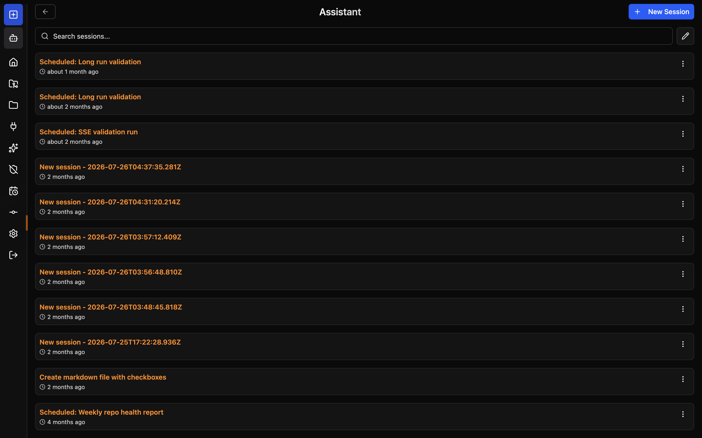

# Assistant Mode

Assistant Mode gives OpenCode Manager a dedicated AI workspace — an isolated directory (`repos/assistant/`) where a built-in assistant agent can manage scheduled jobs, send push notifications, and read or update settings through the `ocm` tool.

## What Is Assistant Mode?

The assistant workspace is a special repository-like directory managed and maintained by OpenCode Manager. When initialized it contains:

| File | Purpose |
|------|---------|
| `AGENTS.md` | Workspace description the agent reads on every session start |
| `opencode.json` | OpenCode configuration scoped to the assistant agent |
| `.opencode/agents/assistant.md` | Agent definition with system prompt and permissions |
| `.opencode/skills/` | Auto-generated skills teaching the agent to use the `ocm` tool |

## Skills Provided

Five skills are provisioned automatically when assistant mode is initialized:

| Skill | What it teaches |
|-------|----------------|
| `schedule-management` | Create, list, update, delete, and run scheduled jobs through the `ocm` `request` action |
| `notifications` | Send push notifications to registered user devices with the `ocm` `send_notification` action |
| `manager-settings` | Read and patch user preferences, read and update the OpenCode configuration file, and reload the assistant workspace, through the `ocm` `request` action |
| `repo-management` | List all managed repositories through the `ocm` `request` action |
| `session-management` | List, create, follow up, read the reply of, and fork sessions through the `ocm` `request` action |

The assistant manages the Manager's global OpenCode configuration file through the `ocm` tool (`/opencode-config`), and the file on disk is the source of truth.

See [Assistant Internal API](assistant-internal-api.md) for the full API reference these skills expose.

## Assistant Persona

The assistant's system prompt, behavior, and durable preferences live solely in `.opencode/agents/assistant.md`. This file is the single source of truth for the assistant agent's personality and self-editing rules. The `opencode.json` configuration no longer duplicates the agent persona — it only stores agent mode and workspace-level settings.

When the assistant self-edits its agent definition (e.g., to refine behavior or add durable preferences), it uses the `manager-settings` skill to call the `POST /assistant/reload` endpoint through the `ocm` `request` action. This rebuilds every loaded location so the changes take effect on the next message. The reload endpoint is rate-limited to 5 requests per minute; the assistant always asks the user before reloading.

## Getting Started

1. Click **Assistant** in the sidebar or mobile tab bar
2. The page opens the Assistant session list
3. Click **New Session** to start a session with the built-in assistant

No manual setup is required. The workspace directory and all managed files are created automatically when the Manager starts.

## Session Views

The Assistant page (`/assistant`) shows the Assistant session list. Selecting a session opens it; **New Session** starts a new one. The page exposes the same management panels as regular repos — file browser, MCP servers, skills, source control, and permissions reset.

## Workspace Initialization

The workspace is initialized idempotently. Managed files are only rewritten when OpenCode Manager has updated their content. User customizations to managed files are preserved.

### Warnings

If a managed file was modified after initialization, the next session will receive an inline prompt explaining which files were preserved and what the expected content is. This surfaces configuration drift without silently overwriting your changes.

### Re-initializing

The workspace is re-applied to its latest defaults automatically when the Manager starts; managed files are only rewritten when their content changed. To clear the Assistant workspace's saved "Allow Always" permissions, open the **Reset Permissions** dialog from the Assistant sidebar (desktop) or the **More** drawer (mobile) and confirm.
