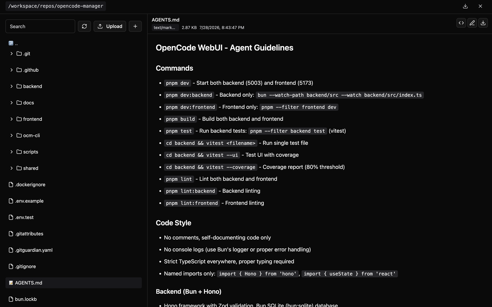

# File Browser

Navigate, view, and manage files within your repositories.

## Directory Navigation

### Tree View

The file browser displays your repository as an expandable tree:

- Click folders to expand/collapse
- Click files to preview content
- Icons indicate file types

### Breadcrumbs

Navigate quickly using the breadcrumb path at the top:

- Click any segment to jump to that directory
- Shows current location in the file tree

### Search

Filter files by name:

1. Type in the always-visible **Search** box
2. Results update as you type

## File Preview

Click any file to preview with:

- **Syntax Highlighting** - Support for common languages
- **Line Numbers** - Easy reference for code discussions
- **Large File Support** - Virtualization for files with many lines

### Supported Languages

Syntax highlighting is provided for common languages including:

- JavaScript, TypeScript, JSX, TSX
- Python, Ruby, Go, Rust
- HTML, CSS, SCSS
- JSON, YAML, TOML, XML
- Markdown, SQL, Shell scripts
- And many more...

## File Operations

### Create File

1. Click the **+** button in the file browser toolbar
2. In the **Create New** dialog, choose **File**
3. Enter a filename with extension
4. Click **Create**; the list refreshes with the new file

### Create Folder

1. Click the **+** button in the file browser toolbar
2. In the **Create New** dialog, choose **Folder**
3. Enter a folder name
4. Click **Create**; the folder is created in the current directory

### Rename

1. Click the **rename** action on a file or folder
2. Enter new name
3. Press Enter to confirm

### Delete

1. Click the **delete** action on a file or folder
2. Confirm deletion

!!! warning
    Deletion is permanent and cannot be undone through the UI. Use git to recover deleted files if needed.

## File Upload

### Drag and Drop

Upload files by dragging them into the browser:

1. Open the target folder
2. Drag files from your computer
3. Drop into the file browser area
4. Files are uploaded to current directory

### Multiple Files

You can drag multiple files at once. They'll all be uploaded to the current directory.

### Upload Limitations

- Large files may take time to upload
- Binary files are supported
- File permissions are set by the server

## ZIP Download

Download directories or repositories as ZIP archives directly from the file browser:

### Download Options

Click the download icon in the file browser header to access download options:

**Current Directory**
- Downloads the folder you're currently viewing
- Includes all subfolders and files
- Useful for archiving specific parts of a project

**Entire Repository**
- Downloads the complete repository
- Same as the download button on repository cards
- Perfect for full repository backups

### Download Process

Both download options follow the same process:

1. Click the download icon in the file browser header
2. Choose **Current Directory** or **Entire Repository**
3. Review the confirmation dialog showing what will be downloaded
4. Click **Download** to begin
5. Wait while the ZIP archive is created (progress indicator shown)
6. ZIP automatically downloads to your computer

### Archive Features

The ZIP archives:

- Respects `.gitignore` - ignored files are excluded
- Excludes `.git` directory
- Uses compression to reduce file size
- Includes proper file permissions
- Preserves directory structure

!!! note
    Download confirmation ensures you're downloading the correct content. Large repositories may take time to create the archive.

## Large File Handling

For files with many lines, the viewer uses virtualization:

- Only visible lines are rendered
- Smooth scrolling through large files
- Memory-efficient display

