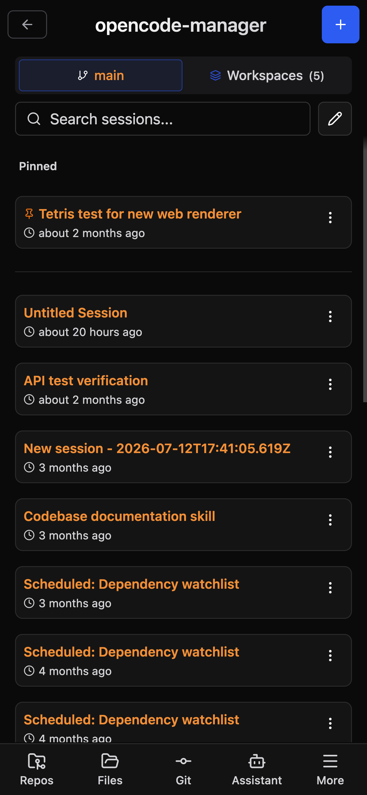

# Mobile & PWA

OpenCode Manager is designed mobile-first and works as a Progressive Web App.

## Mobile-First Design

The UI is optimized for mobile devices:

- Touch-friendly controls
- Responsive layouts
- Adaptive components
- Gesture support

{ .phone }

## Installing as PWA

### iOS

1. Open OpenCode Manager in **Safari**
2. Tap the **Share** button (square with arrow)
3. Scroll down and tap **Add to Home Screen**
4. Name the app and tap **Add**

!!! note
    PWA installation only works in Safari on iOS. Chrome and other browsers don't support PWA on iOS.

### Android

1. Open OpenCode Manager in **Chrome**
2. Tap the **menu** (three dots)
3. Tap **Install app** or **Add to Home Screen**
4. Confirm installation

### Desktop

#### Chrome

1. Look for the install icon in the address bar
2. Click **Install**
3. App opens in its own window

#### Edge

1. Click the menu (three dots)
2. Select **Apps > Install this site as an app**
3. Name and install

## PWA Features

### App Shell Caching

Static assets are cached for faster loads:

- App shell (HTML, CSS, JS)
- Icons and images
- Fonts and static assets

Full functionality requires network connection to the backend.

### Background Updates

The PWA updates automatically:

- New versions download in background
- Prompt to refresh when ready
- No manual update needed

### Native-Like Experience

- Runs in its own window
- No browser chrome
- App icon on home screen
- Task switcher integration

## Mobile Keyboard

### iOS Keyboard Handling

Special handling for iOS virtual keyboard:

- Input field stays above keyboard
- Viewport adjusts automatically
- No content hidden behind keyboard

### Enter Key Behavior

On mobile, pressing Enter:

1. Closes the virtual keyboard
2. Sends the message

Use **Shift+Enter** for new lines.

### Keyboard Shortcuts

Mobile keyboards have limited shortcut support. Type directly in the composer:

- Type **@** to mention files
- Type **/** to access commands
- Toggle Plan/Build modes with the mode selector
- Use the composer **+** menu to accept all permissions, arm goal mode, or attach an image or PDF

## Swipe Navigation

Navigate with gestures:

### Swipe Right

Swipe from the left edge to go back to the previous view, wherever a back target exists.

### Swipe Left

On a session route, swipe from the right edge to open the More drawer.

### Swipe Requirements

- Start from the left edge (first 30px) to go back
- Swipe at least 80px right

## Touch Optimizations

### Larger Touch Targets

All interactive elements have minimum 44x44px touch targets for easy tapping.

### Row Actions

Per-item actions are available without a context menu:

- Files: open the **⋯** menu on a row for download, rename, and delete
- Messages: use the **copy** button on a message block
- Sessions: swipe a session left to reveal **delete**, or use manage mode to delete several

