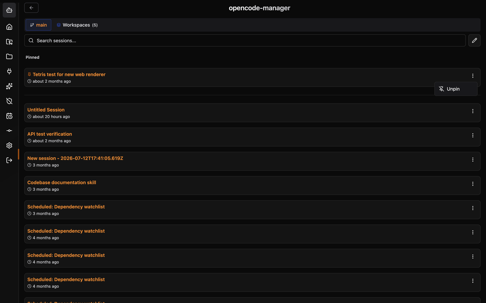

# Session Pinning

Pin important sessions to the top of your session list so you can find them quickly without searching.

## Overview

Session pinning lets you mark any session as "pinned" — it moves to a dedicated **Pinned** section above your other sessions. This is useful for:

- Active feature branches you switch between throughout the day
- Long-running investigations or debugging sessions
- Sessions with important context you want to keep accessible

## Pinning a Session

Each session card has an actions menu (the **⋮** button, hidden in manage mode); its entry toggles pinning:

The pinned session appears in a **Pinned** section above the **Today** section and older sessions. Unpinned sessions stay in those sections, sorted by last activity.

Pin state persists across page reloads and browser sessions. Pinned sessions remain at the top until you unpin them.

## Managing Pins

| Action | How |
|--------|-----|
| **Pin a session** | Open the session actions menu and select **Pin to top** |
| **Unpin a session** | Open the session actions menu and select **Unpin** — it moves back to the Today or older sessions |
| **Bulk operations** | Pin/unpin is per-session. Bulk delete and other management tools work as normal on pinned sessions |

## What Happens When a Pinned Session is Deleted

Deleting a pinned session from the Manager also removes its pin. A pinned session deleted elsewhere, such as from the OpenCode TUI, disappears from the Pinned section, but its pin record stays in the Manager database.

## Notes

- In the sidebar, pinned sessions are always shown, even ones too old to have loaded. The full session list loads 25 sessions at a time, so an older pinned session appears in its Pinned section only after scrolling loads it.
- The Pinned section supports any number of pinned sessions.
- Pinning is stored server-side in the Manager and is Manager-wide rather than per-user, so the same pins are shown on every device and browser.
